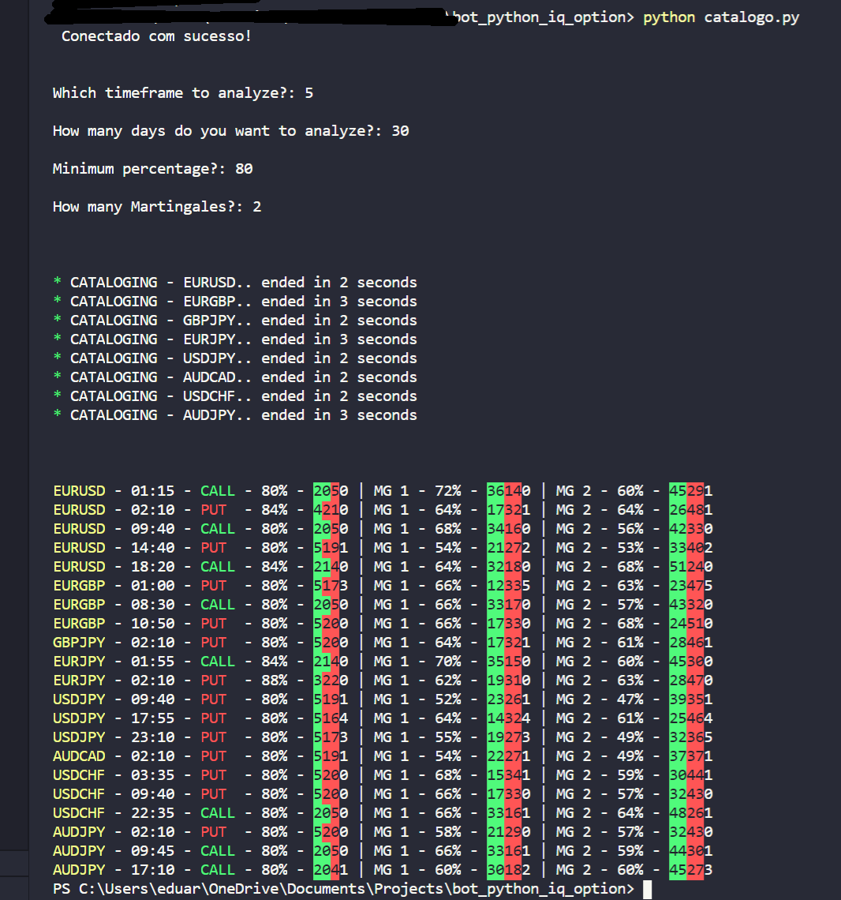

<!-- PROJECT LOGO -->
<br />
<p align="center">
  <a href="http://gattitrading.com/components">
    
  </a>

  <h3 align="center">Bot Python IqOption</h3>

  <p align="center">  
  Bot responsible for automating the process of cataloging binary options market forecasts and performing operations.
    <br />
    <a href="https://github.com/CarlosGatti/bot_python_iq_option"><strong>Explore the docs »</strong></a>
    <br />
    <br />
    <a href="https://github.com/CarlosGatti/bot_python_iq_option/issues">Report Bug</a>
    ·
    <a href="https://github.com/CarlosGatti/bot_python_iq_option/issues">Request Feature</a>
  </p>
</p>


<!-- TABLE OF CONTENTS -->
## Table of Contents

* [About the Project](#about-the-project)
  * [Built With](#built-with)
* [Getting Started](#getting-started)
  * [Prerequisites](#prerequisites)
  * [Installation](#installation)
* [Usage](#usage)
* [Roadmap](#roadmap)
* [Contributing](#contributing)
* [License](#license)
* [Contact](#contact)
* [Acknowledgements](#acknowledgements)

<br />

<!-- ABOUT THE PROJECT -->
## About The Project

These robots can help a beginner in the investment market as well as help professionals. Artificial Intelligence can be a powerful resource for identifying behaviors and automating repetitive processes.

Here's why:
* A bot is capable of storing large amounts of data
* A bot is capable of processing a large volume of data and turning everything into information
* The bot is able to learn this information and help you make important decisions for your investment

We can think of this project as a tool that will help professionals at all levels of learning. The progress of the market validates the idea of ​​constant improvement.

A list of commonly used resources that I find helpful are listed in the acknowledgements.

### Built With
This section should list any major frameworks that you built your project using. Leave any add-ons/plugins for the acknowledgements section. Here are a few examples.
* [Python](https://python.com)


<br />

<!-- GETTING STARTED -->
## Getting Started
This example requires the use of an external API, to install just follow the steps of the developer. 


### Installation

1. Get a free API Key at [Here](https://github.com/dsinmsdj/iqoptionapi)
2. Clone the repo
```sh
git clone https://github.com/dsinmsdj/iqoptionapi

```

### Prerequisites
You will need to install Python 3 for a better experience.

<br />
### Bot startup list:

* catalog prediction
```sh
python catalogo.py 
```

* mhi
```sh
python mhi.py 
```

* moving average
```sh
python moving_average.py 
```

* follow
```sh
python follow.py 
```

* signals
```sh
python signals.py 
```

* news
```sh
python news.py 
```


<!-- USAGE EXAMPLES -->
## Usage

Below is an example of how to run the bot.

  <a href="http://gattitrading.com/components">
    
  </a>

_For more examples, please refer to the [Documentation](http://gattitrading.com)_


<!-- ROADMAP -->
## Roadmap

See the [open issues](https://github.com/CarlosGatti/bot_python_iq_option/issues/) for a list of proposed features (and known issues).


<!-- LICENSE -->
## License

Distributed under the MIT License. See `LICENSE` for more information.


<!-- CONTACT -->
## Contact

Carlos Gatti - [@instagram](https://instagram.com/carloseduardogatti) - eduardo.gf@hotmail.com

Project Link: [https://github.com/carlosgatti/bot_python_iq_option](https://github.com/CarlosGatti/bot_python_iq_option)


<!-- ACKNOWLEDGEMENTS -->
## Acknowledgements
* [API :: Lu-Yi-Hsun](https://github.com/Lu-Yi-Hsun/iqoptionapi/)


